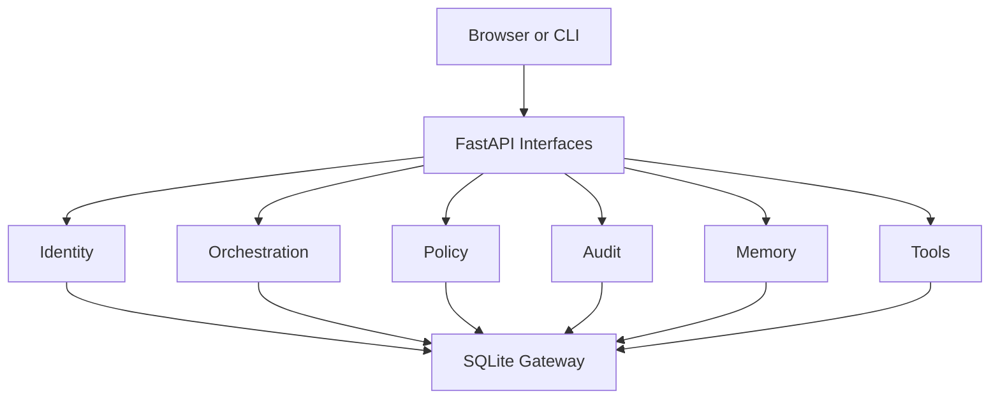

# AgentKinetics

> Durable, local-first agent orchestration with explicit approvals and audit trails.


[](https://github.com/VIKAS9793/agentkinetics/releases)
[](https://www.python.org/)
[](https://fastapi.tiangolo.com/)
[](https://www.langchain.com/langgraph)
[](https://docs.pydantic.dev/)
[](https://www.sqlite.org/)
[](https://www.uvicorn.org/)
[](https://pytest.org/)
[](./LICENSE)

## What It Is

AgentKinetics is a modular monolith for running AI workflows that must survive interruption, preserve operator intent, and keep a usable evidence trail.

Instead of treating an agent run like a disposable chat session, AgentKinetics treats it like an operational record:

- every run is persisted
- every state transition is auditable
- approvals are explicit
- the local operator stays in control

The current product surface includes:

- a local operator bootstrap and sign-in flow
- bounded run creation
- a live runs queue
- an inspector for checkpoints, audit events, and approvals
- role-aware lifecycle controls for resume, interrupt, retry, cancel, and approval decisions

## Why It Exists

Modern agent demos hide the hard part: what happens when the model stalls, the process dies, approval is required, or the operator needs to reconstruct what already happened.

AgentKinetics is built to close that gap. It is designed for operators who care about:

- durable execution instead of prompt replay
- local-first control instead of cloud dependency
- explicit governance instead of hidden state changes
- inspectable evidence instead of black-box automation

## Current Architecture

The system is organized around a single source of truth in SQLite and explicit module boundaries in `src/agentkinetics/`:

| Context | Responsibility |
| --- | --- |
| `identity` | local users, sessions, roles, PBKDF2 password hashing |
| `orchestration` | run lifecycle, checkpoints, workflow engine integration |
| `policy` | approval gating and lifecycle guardrails |
| `audit` | append-only event lineage and SSE-backed live updates |
| `memory` | durable memory abstractions for future agent state layers |
| `tools` | tool contracts and execution boundaries |
| `interfaces` | FastAPI routes, CLI commands, server-rendered product UI |
| `storage` | SQLite schema and repository gateway |



For the deeper system view, see [docs/architecture.md](./docs/architecture.md).

## Product Screens

Desktop viewport captures from the current product shell:

### Overview


### Access


### Runs


### Inspector


## What Runs

There is one local application process.

- The product UI is served at `http://127.0.0.1:8000/`
- The API is served by the same FastAPI app
- There is no separate frontend dev server
- Default local storage lives under `data/`

Default local paths:

- database: `data/agentkinetics.sqlite3`
- artifacts: `data/artifacts/`

## Local Quick Start

Clone the repo and run commands from the repository root:

```powershell
git clone https://github.com/VIKAS9793/agentkinetics.git
cd agentkinetics
```

Windows PowerShell:

```powershell
py -3.11 -m venv .venv
.\.venv\Scripts\python.exe -m pip install -e ".[dev,orchestration]"
.\.venv\Scripts\python.exe -m pytest
.\.venv\Scripts\python.exe -m uvicorn agentkinetics.app:app --host 127.0.0.1 --port 8000
```

macOS or Linux:

```bash
python3.11 -m venv .venv
./.venv/bin/python -m pip install -e ".[dev,orchestration]"
./.venv/bin/python -m pytest
./.venv/bin/python -m uvicorn agentkinetics.app:app --host 127.0.0.1 --port 8000
```

Then open:

- Product UI: `http://127.0.0.1:8000/`
- Health: `http://127.0.0.1:8000/health`
- Admin surface: `http://127.0.0.1:8000/admin`

For the exact setup guide, troubleshooting notes, and CLI alternatives, see [SETUP.md](./SETUP.md).

## Local Test Credentials

The simplest first-run path is to create the operator in the UI:

1. Open `http://127.0.0.1:8000/`
2. In `Set up local operator access`, create:
   - Username: `admin`
   - Display name: `Admin UI`
   - Password: `correct horse battery staple`
   - Role: `admin`
3. In `Enter the run workspace`, sign in with:
   - Username: `admin`
   - Password: `correct horse battery staple`

These are dummy local-only credentials for development and documentation.

CLI bootstrap alternative:

```powershell
.\.venv\Scripts\agentkinetics-cli.exe init-db
.\.venv\Scripts\agentkinetics-cli.exe create-user --username admin --password "correct horse battery staple" --display-name "Admin UI" --role admin
```

## Common Commands

Run tests:

```powershell
.\.venv\Scripts\python.exe -m pytest
```

Start the app:

```powershell
.\.venv\Scripts\python.exe -m uvicorn agentkinetics.app:app --host 127.0.0.1 --port 8000
```

Use the packaged app entrypoint:

```powershell
.\.venv\Scripts\agentkinetics-api.exe
```

Show one run from the CLI:

```powershell
.\.venv\Scripts\agentkinetics-cli.exe show-run <run_id>
```

## Clean Reset

Stop the app, then remove the local runtime data:

- `data/agentkinetics.sqlite3`
- `data/artifacts/`

Restart the app and create the first operator again.

## Project Resources

| Document | Purpose |
| --- | --- |
| [SETUP.md](./SETUP.md) | exact setup, commands, paths, and local troubleshooting |
| [POLICY.md](./POLICY.md) | product and governance rules |
| [SECURITY.md](./SECURITY.md) | security posture and vulnerability reporting |
| [CONTRIBUTING.md](./CONTRIBUTING.md) | contribution workflow and engineering rules |
| [docs/ADR.md](./docs/ADR.md) | architectural decisions and trade-offs |
| [docs/architecture.md](./docs/architecture.md) | system boundaries, data flow, and runtime model |

## Scope

AgentKinetics is not a hosted SaaS platform, a chatbot shell, or a cloud-only orchestration layer.

It is a local-first control plane for bounded agent workflows that need durable state, operator review, and replayable evidence.

## Authorship

Project Lead: Vikas Sahani  
[vikassahani17@gmail.com](mailto:vikassahani17@gmail.com)  
[LinkedIn](https://linkedin.com/in/vikas-sahani-727420358)  
[GitHub](https://github.com/VIKAS9793)

Engineering: OpenAI Codex
