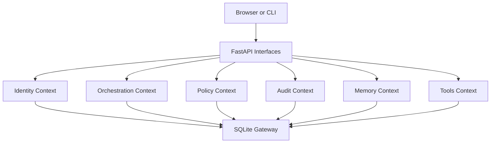

# AgentKinetics Architecture

AgentKinetics is a modular monolith built around a single source of truth in SQLite.

The design goal is straightforward:

- keep workflow state durable
- keep approvals explicit
- keep module boundaries clean
- keep the local operator in control

## Runtime Shape

Today the system runs as one FastAPI application process:

- server-rendered product UI
- REST API
- SSE event stream
- local SQLite storage
- local filesystem artifacts

There is no separate frontend service in the current repo.

## Core Contexts

### Identity

Owns:

- local user creation
- password hashing
- session issuance
- role checks

### Orchestration

Owns:

- run lifecycle
- checkpoints
- workflow invocation
- run detail assembly

### Policy

Owns:

- approval gating
- lifecycle restrictions
- operator decision constraints

### Audit

Owns:

- append-only event lineage
- tenant-scoped audit reads
- event stream data for live UI updates

### Memory

Owns the durable memory boundary for future agent state layers.

### Tools

Owns the tool contract boundary for future real-world actions and adapters.

### Storage

Owns:

- schema initialization
- repository persistence
- the authoritative relational state model

## Interfaces

The main runtime interfaces today are:

- `GET /` for the product UI
- `GET /health`
- `POST /auth/local/users`
- `POST /auth/local/sessions`
- `GET /auth/session`
- `POST /auth/session/logout`
- `POST /events/ticket`
- `GET /events/stream`
- `POST /runs`
- `GET /runs`
- `GET /runs/{run_id}`
- `POST /runs/{run_id}/resume`
- `POST /runs/{run_id}/interrupt`
- `POST /runs/{run_id}/retry`
- `POST /runs/{run_id}/cancel`
- `POST /runs/{run_id}/request-approval`
- `POST /approvals/{approval_id}/decide`

The CLI currently exposes:

- `agentkinetics-cli init-db`
- `agentkinetics-cli create-user`
- `agentkinetics-cli show-run`

## Data Model Direction

The current SQLite model already anchors state around:

- tenants
- users
- sessions
- runs
- checkpoints
- approvals
- audit events

The architecture is designed so those boundaries can evolve without changing the domain contracts.

## Scale Path

The intended path is evolutionary, not a rewrite:

1. local modular monolith
2. stronger tool and memory adapters
3. stateless API replicas over the same contracts
4. storage and execution adapters swapped without rewriting domain logic

That is why interfaces and repository boundaries matter from the start.
